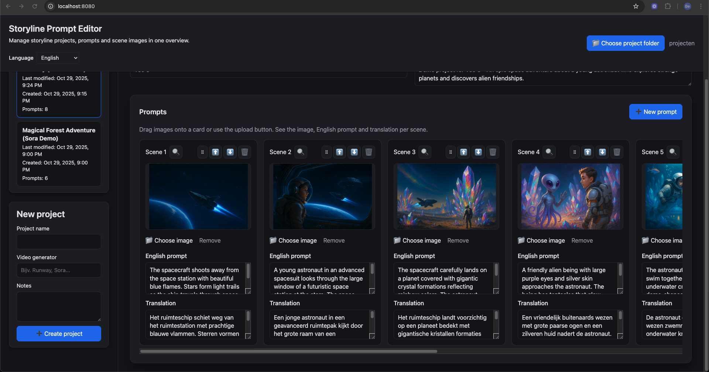
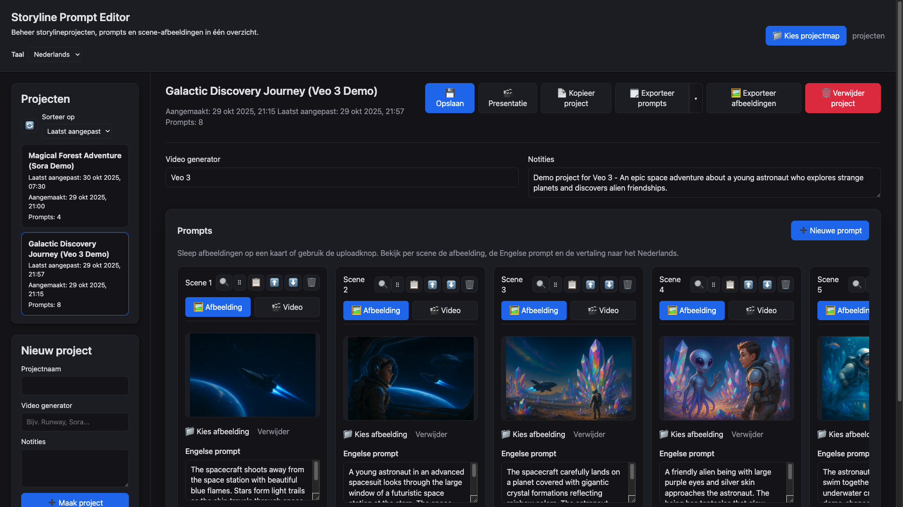
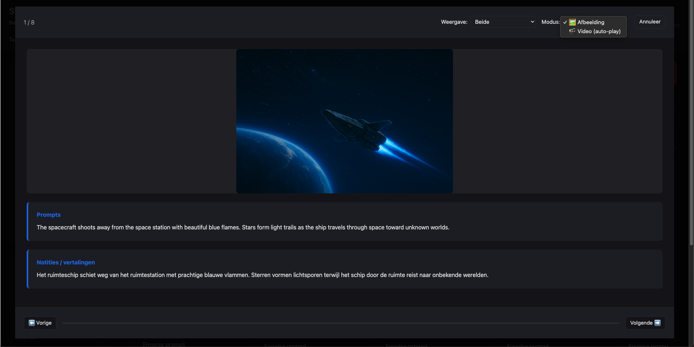
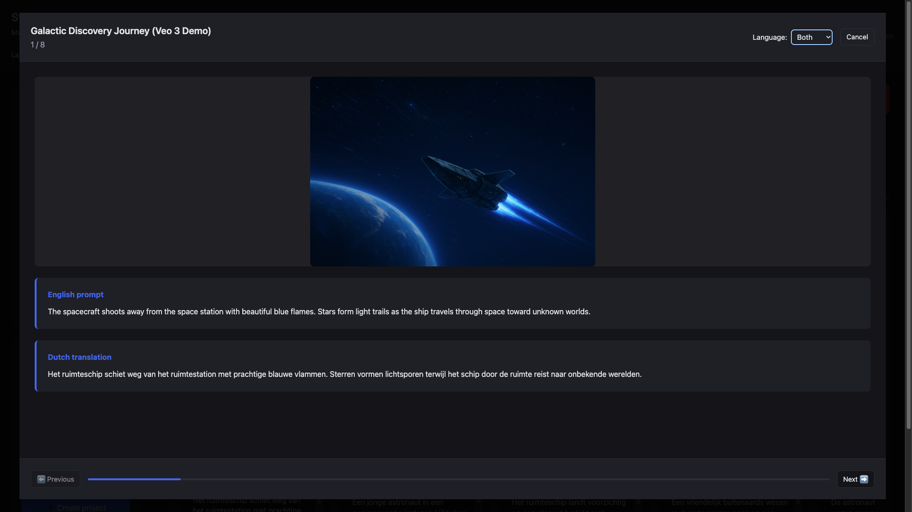
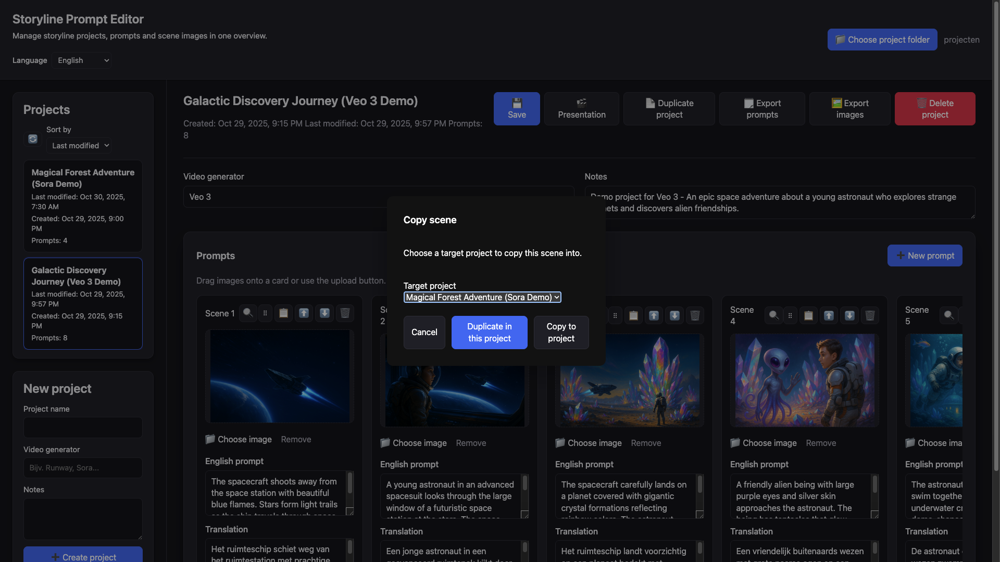

# Storyline Prompt Editor

[](https://youtu.be/gxHS0iwoO0U?si=gFUd9JmBjGY3Wzks)

This project is a browser-based workspace for crafting video LLM prompts while steadily tracking the entire storyline of your production. It was built to make it easy to manage prompts, starter/ending images, translations, and project notes in one place and to carry that context across machines.



## Recent update — 6 November 2025

This release enhances the scene editing workflow with quick navigation:

- **Scene dialog navigation**: when editing a scene in the popup dialog, you can now navigate directly to the previous or next scene using arrow buttons (⬅️ ➡️) in the dialog header. No need to close and reopen—just click through your scenes.
- **Keyboard shortcuts**: use the left and right arrow keys (← →) to quickly jump between scenes while editing. Works seamlessly unless you're typing in a text field.
- **Auto-save on navigation**: changes to prompts and translations are automatically saved when you navigate to another scene, ensuring no work is lost.
- **Smart button states**: navigation buttons are automatically disabled at the first and last scene, providing clear visual feedback about your position in the storyline.

This update makes it effortless to review and edit your entire storyline in one continuous flow, perfect for fine-tuning prompts and checking consistency across scenes.


## update — 5 November 2025

- Add video
   
- Presentation mode preview + video:
   

This release adds comprehensive video workflow support based on real-world user feedback:

- **Video upload per scene**: in addition to images, you can now upload the final rendered video (MP4/WebM) for each scene. This lets you keep prompts, reference images, and final results together in one place.
- **Toggle between image and video**: each scene card has a toggle to switch between viewing the reference image or the rendered video, keeping your workspace clean and focused.
- **Combined video presentation mode**: presentation mode now includes a "🎬 Video (auto-play)" option that plays all scene videos back-to-back as one continuous film. This gives you an instant preview of your entire production and helps identify what needs improvement.
- **Video timeline with scrubbing**: the presentation footer shows a timeline slider with markers for each video segment. Click or drag to jump to any point in your "film", with automatic prompt text sync.
- **Full video workflow**: videos are stored in a separate `videos/` folder per project, copied when duplicating projects or scenes, and support drag & drop upload just like images.
- **Popup dialog improvements**: when opening a scene, both the reference image and rendered video are displayed vertically for easy comparison.

Previous update: 4 November 2025

  
  

How to use video features:

- **Upload video**: click the "🎬 Video" toggle on a scene card, then drag a video file or click to upload. Supported formats: MP4, WebM.
- **View in presentation**: click "Presentation" in the project header, then select "🎬 Video (auto-play)" from the mode dropdown. All videos play automatically with synced prompt text.
- **Navigate timeline**: use the slider in the footer to scrub through all videos, or use Previous/Next in image mode. Markers show where each video segment begins.
- **Compare results**: open any scene to see both the reference image (top) and rendered video (bottom) side by side.

These updates reflect ongoing development based on feedback from video AI creators who need to track both inputs (prompts/images) and outputs (rendered videos) in a single workspace.

## update — 4 November 2025

This release improves export workflows and dialog feedback:

- **Export notes/translations**: in addition to exporting prompts, you can now choose to export only notes or translations. The export dialog offers a menu to select what to export. Presentation mode also supports viewing prompts, notes, or both side by side.
- **Improved dialogs & feedback**: export status messages, image export confirmations, and project duplication now use professional modal dialogs instead of browser alerts. Copy-to-clipboard feedback shows confirmation.
- **Bug fixes & robustness**: fixed export handling for missing images, improved file permission handling, and ensured operations complete gracefully even when source files are temporarily unavailable. Exporting images multiple times now works reliably without re-clearing the output folder.

Previous published version: 3 November 2025


- Copy scenes dialog:  
   
- Presentation mode preview:
   

How to use the new features (short):

- Copy a scene: open the scene menu (clipboard icon) and choose "Copy scene". Select target project (or choose the same project) and click "Duplicate in this project" or "Copy to project".
- Duplicate/delete project: in the project header use the "Duplicate project" or "Delete project" buttons. Deleting asks for confirmation.
- Presentation mode: click the "Presentation" button in the project header to enter fullscreen review mode. Use keyboard arrows to move between scenes.

These notes are also reflected in the Dutch README (`README.nl.md`).

## Why this tool?

I first created this editor as a handy companion while producing video prompts for generative models. I wanted a smooth way to:

- Keep start and end reference images together with the text prompts.
- See the entire storyline from scene to scene without losing the big picture.
- Store English prompts alongside Dutch translations for quick hand-off or localisation.
- Export image sequences and prompt scripts per project so nothing gets lost.

## Highlights

- **Project explorer** – create, open, and sort storyline projects with automatic last-modified tracking.
- **Scene board** – drag scenes horizontally, reorder via drag handles, edit prompts in-place, or open a fullscreen dialog for focused editing.
- **Image workflow** – drop or upload images per scene, export all images as numbered files, and preview large versions instantly.
- **Prompt exports** – review prompts in a dialog, copy them to the clipboard, and save a text file in the project folder in one step.
- **Browser storage** – remembers your chosen project directory between sessions (using the browser’s File System Access API).
- **Bilingual UI** – switch between Dutch and English labels from the header.
- **Portable by design** – everything lives inside a single `storylineprompteditor` folder that you can copy to another machine.

## Project layout

```
storylineprompteditor/
├─ assets/
│  ├─ css/
│  │  └─ style.css           # Global styling
│  └─ js/
│     ├─ app.js              # Main application logic
│     └─ translations.js     # Locale definitions (NL/EN)
├─ server.sh                 # Helper script to start/stop a local dev server
├─ index.html                # Application entry point
├─ README.md                 # English documentation (this file)
└─ README.nl.md              # Dutch documentation
```

## Getting started

1. **Install requirements**  
   You only need Python 3 (or any static file server). Nothing else is required.

2. **Launch the local server**

   ```bash
   ./server.sh start
   ```

   - Default address: `http://localhost:8123/opdracht/storylineprompteditor/`
   - `./server.sh status` shows the running PID.
   - `./server.sh stop` terminates the server.

3. **Open the editor**  
   Use Chrome or Edge. Click “📁 Choose project folder” and select a writable directory. The tool will create:
   - `projecten/` containing JSON data + images per project
   - `index.json` with the global project list

4. **Create or open projects**  
   Once a root folder is selected, you can add projects, manage scenes, upload images, and export prompts.

## Browser support

- Requires a secure context (`http://localhost`) and the File System Access API.  
- Chrome ≥ 86 and Edge (Chromium) are supported. Safari/Firefox currently lack the APIs needed for full functionality.

## Contributing & notes

- No build step is required; everything is native HTML/CSS/JS.
- If you copy this folder to another machine, just run `./server.sh start` and continue working.
- Feel free to extend `assets/js/translations.js` with additional languages or tweak styles in `assets/css/style.css`.

---

Built to keep video prompt workflows focused, organised, and portable—enjoy crafting your next storyline!

