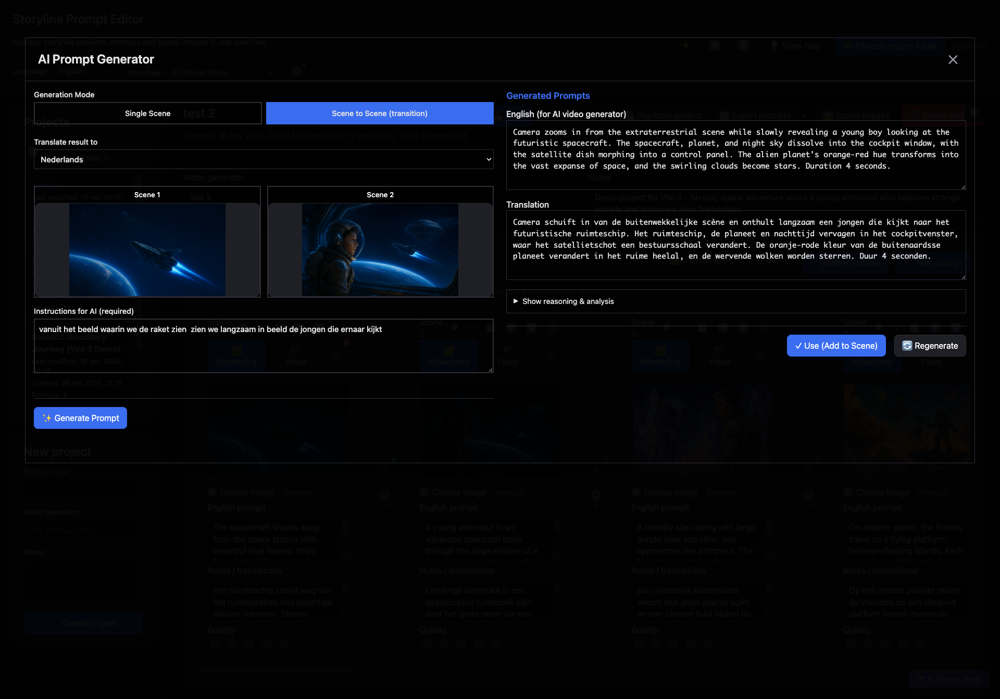
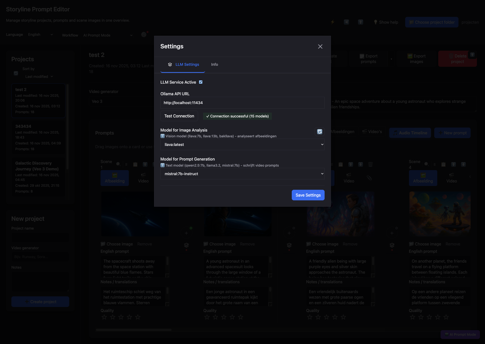
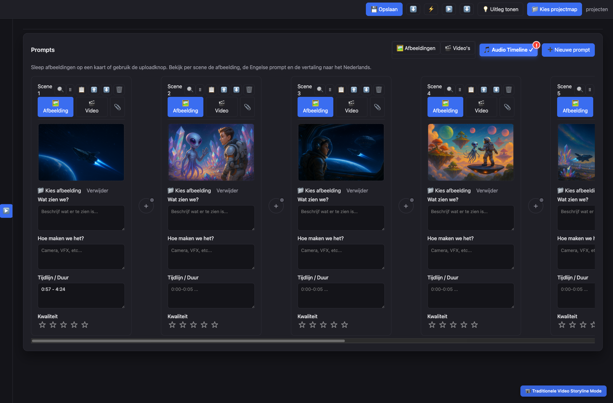
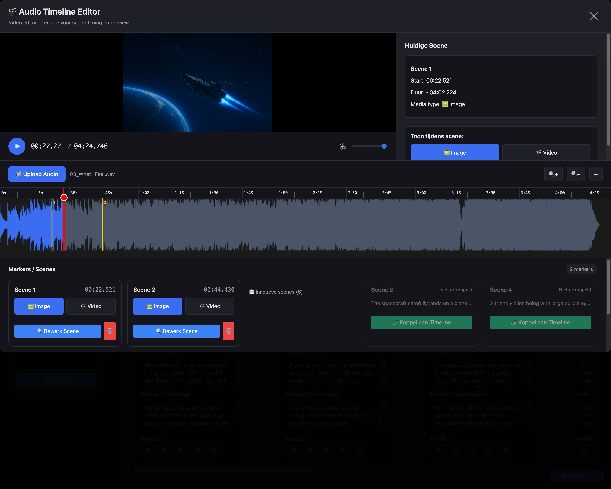
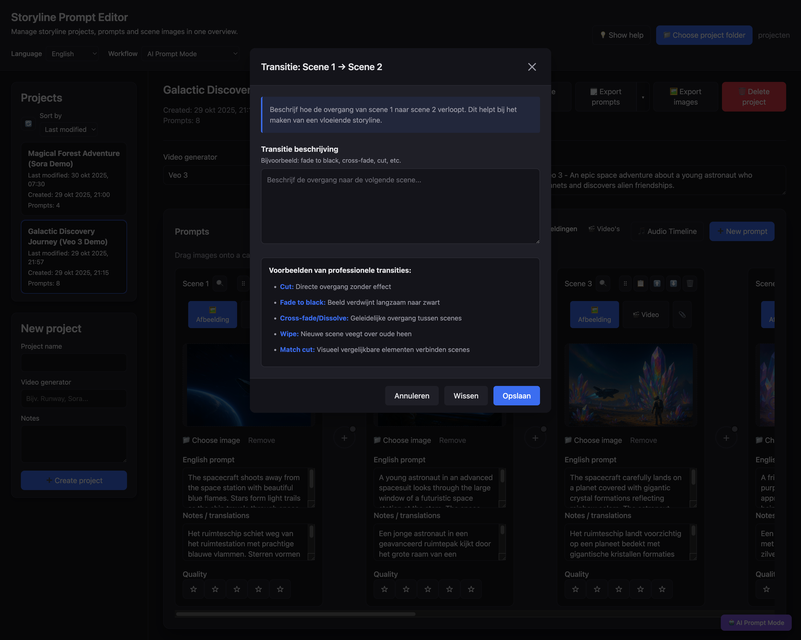
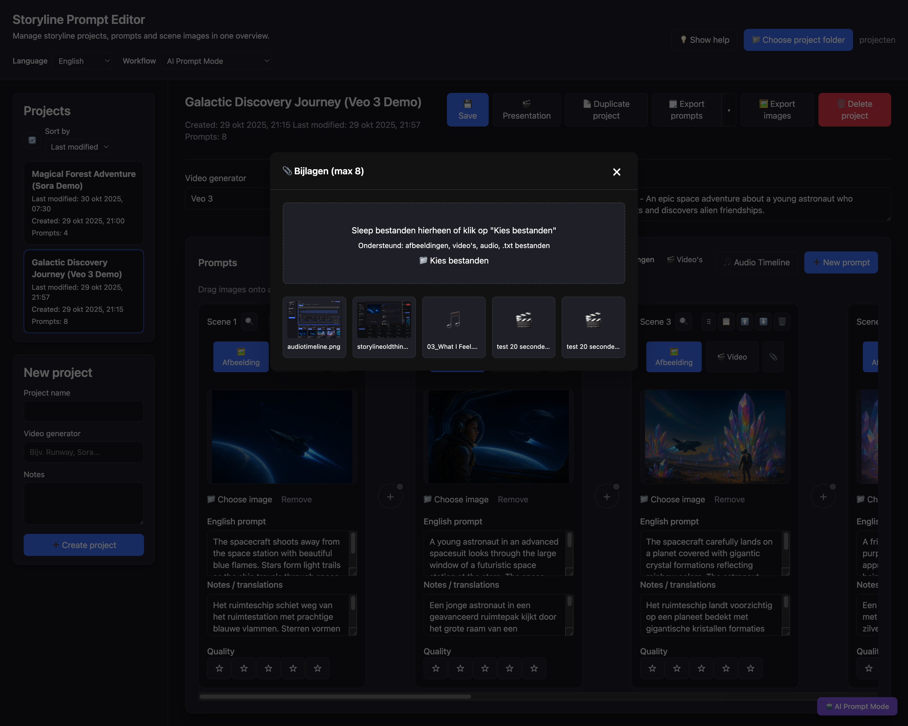
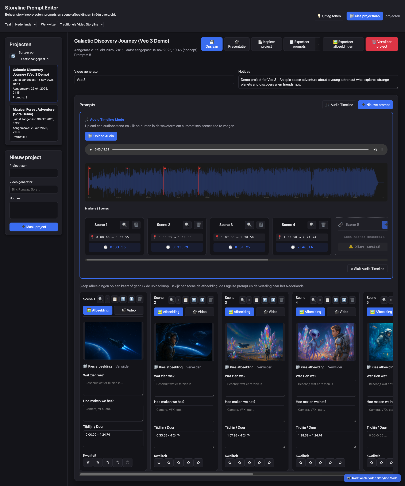
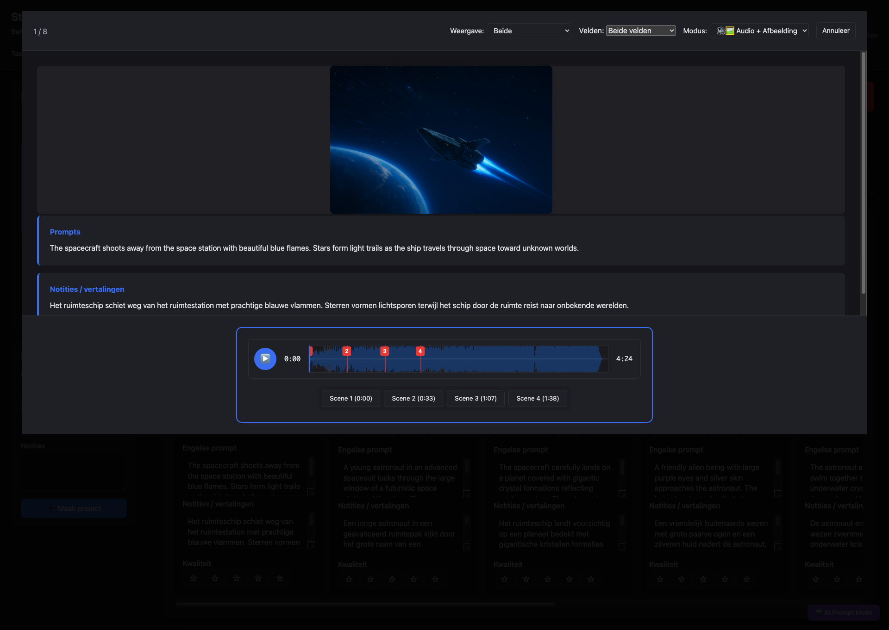
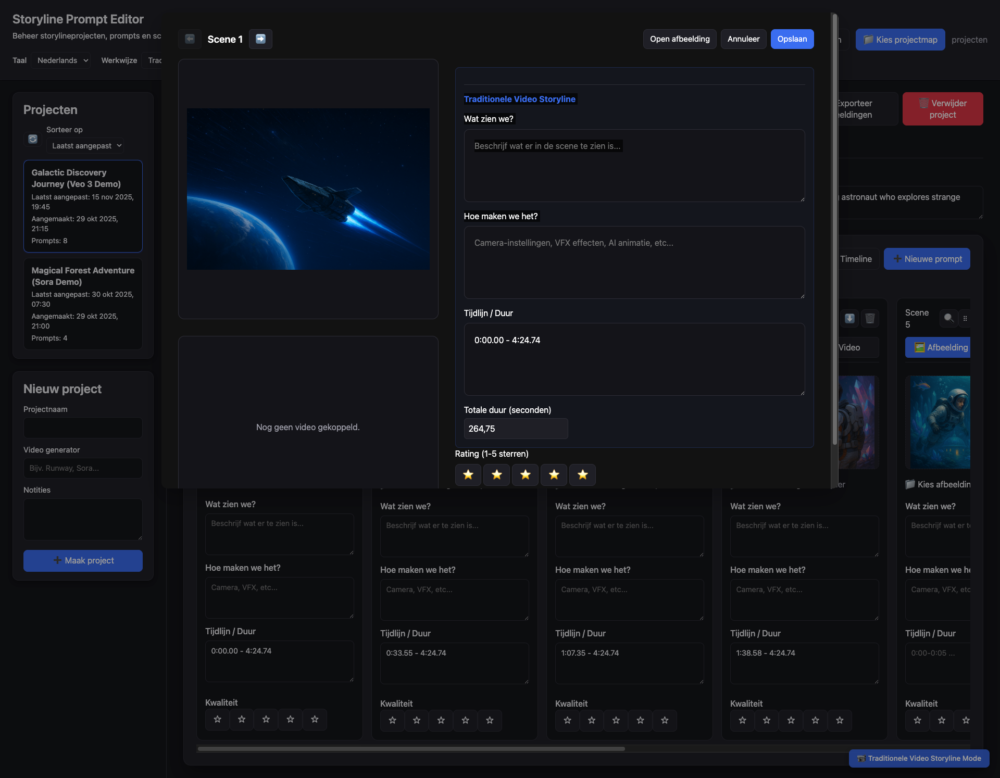

# Storyline Prompt Editor

Dit project is een browser-gebaseerde werkplek voor het schrijven van video LLM-prompts, inclusief start- en eindbeelden én overzicht over de volledige verhaallijn. Je kunt projecten bewaren, scènes herschikken en exports maken, zodat je altijd grip houdt op je videoverhaal.


## update — 30 november versie 3.31

- Notities maken bij scènes met status "open" of "verwerkt".
- Optimalisaties voor AI, onder andere voor WAN 2.2 image‑to‑image, OVI en camera movement (WAN 2.2); Lightning‑profiel en snelle selecties.
- Diverse optimalisaties onder de motorkap.

Opmerking: we hebben de LLM-promptschrijver ook getest met gpt-oss-20b; dat gaf best goede resultaten. Het is nog experimenteel, maar wordt steeds meer een nuttige toevoeging in de workflow om snel langere scènes op te bouwen. Dit gebeurt vaak door meerdere korte AI-renders (bijv. 20 video's van 10 seconden) zodanig te genereren dat ze in totaal als één vloeiende video lijken te functioneren.

Tip: om gezichten te verbeteren wanneer de rest van de video goed is maar gezichten onscherp of onnatuurlijk zijn (doordat de AI te weinig pixels had om het gezicht goed op te bouwen), kun je de tool FaceFusion gebruiken: https://github.com/facefusion/facefusion. Hiermee kun je gezichten optimaliseren zodat ze weer natuurlijk en scherp in beeld komen.

 

## 19 november 3.0

De 3.0-release voelt als een frisse wind door de audio timeline editor: markers reageren directer, scrubbing blijft stabiel en de fullscreen editor oogt rustiger nu de overbodige knoppen zijn verdwenen. Hierdoor kun je makkelijker in één flow scènes koppelen aan je audio en blijf je beter zien waar je je in de soundtrack bevindt.

Onder de motorkap hebben we de workflow verder opgeschoond. Layout- en workflowtoggels zitten nu in een eigen controller, de Ollama-integratie controleert URLs slimmer zodat promptgeneratie niet meer struikelt over dubbele slashes, en de README-structuur is bijgewerkt zodat nieuwe teamleden sneller hun weg vinden. Deze release legt zo de basis voor de volgende ronde features zonder dat je huidige projecten iets van hun stabiliteit verliezen.

## 18 november versie 2.2

**Audio Timeline Workflow Verbeteringen**

Na intensief testen van de audio timeline functionaliteit in onze dagelijkse video 4.0 productie hebben we een aantal belangrijke verbeteringen doorgevoerd:

**Persistentie & Betrouwbaarheid:**
- Audio marker koppelingen blijven nu correct behouden bij opslaan en herladen van projecten
- Scene en marker synchronisatie werkt nu realtime - wijzigingen zijn direct zichtbaar zonder herladen
- Presentation mode speelt nu betrouwbaar af met de juiste audio markers

**Workflow Optimalisaties:**
- Bij audio projecten kun je de scene volgorde alleen nog via de audio timeline aanpassen (move buttons zijn verborgen)
- Scene cards tonen nu een 🎵 muzieknootje met marker tijd in plaats van "Scene X"
- Nieuwe "Delete Audio" functie met professionele bevestigingsdialoog - verwijdert audio en reset project naar normale modus
- Marker verwijderen ontkoppelt direct de scene (wordt inactief)
- Scene verwijderen verwijdert automatisch de gekoppelde marker

**Technisch:**
- Complete code cleanup - alle debug logging verwijderd voor productie
- Verbeterde event-driven architectuur voor betere synchronisatie tussen UI componenten
- Backwards compatible - oude projecten werken gewoon door

Deze updates maken de audio timeline workflow productie-ready voor dagelijks gebruik in video 4.0 projecten.


## 17 november versie 2.1

Je kunt nu nog sneller een video-prompt genereren direct vanuit de editor: we hebben Ollama geïntegreerd zodat je een korte instructie kunt invoeren, de editor de scène-afbeelding analyseert en automatisch een WAN 2.2‑compatibele video‑prompt genereert (ook image→image ). 

Zo kun je snel een storyline opzetten met verschillende prompts en afbeeldingen. Vervolgens kun je alle gegenereerde prompts en bijbehorende afbeeldingen exporteren en direct in de wachtrij van je video‑server plaatsen voor uitvoering.

Belangrijk:
- Je kunt zelf kiezen welk Ollama‑model je wilt gebruiken via de instellingen; de editor test de connectie en toont beschikbare modellen.
- Voor onze tests en als standaardconfiguratie gebruiken we llava:7b voor image‑analyse en mistral:7b‑instruct‑v0.3 voor promptgeneratie — de workflow is specifiek getuned op WAN 2.2 outputformaten.
- Aanbevolen alternatieven (getest): vision: llava:13b, bakllava, moondream; text: qwen2.5:7b, qwen2.5:14b, llama3.2, llama3.1:8b. Voor productieadvies raden wij ollama pull mistral:7b-instruct aan vanwege betere format‑nauwkeurigheid.
- 
- **LLM vereist lokale Ollama‑installatie**:  
   Ollama moet draaien op dezelfde machine als de editor (`http://localhost:11434`).  
   Voor gebruik op afstand (bijv. `myeditor.nl`) moet Ollama op de server staan of je gebruikt een CORS‑bypass extensie voor ontwikkeling/testen (niet aanbevolen voor productie).

- **Als je online draait**, start Chrome zonder CORS‑controles:

   ```bash
   open -na "Google Chrome" --args --disable-web-security --user-data-dir="/tmp/chrome-no-cors"
   ```

Kort samengevat: snel invoeren → afbeelding analyseren → WAN 2.2‑geformatteerde prompt genereren → exporteren of in de server‑queue zetten. Kies het model dat bij jouw workflow past; de editor bewaart per project welke modellen er zijn gebruikt.

  
  

##  16 november 2025

Gezien onze workflows bij playanote.nl, waarin veelal vanuit een audiobestand een video wordt opgebouwd, hebben we een speciale editor toegevoegd om snel een storyline op te zetten. Je kunt een audiobestand inladen en scènes eraan koppelen, waardoor je eenvoudig storyboards maakt voor zowel greenscreen-opnamen als prompts voor een AI-video-server. Dit versnelt de productie aanzienlijk en is nuttig voor teams en makers die een op audio gebaseerde 4.0 video-workflow hanteren.

Wil je de tool direct proberen zonder installatie? Stuur ons via een van onze platformen een e-mail; we sturen je dan een URL (en inlog) zodat je meteen aan de slag kunt.

Privacy en veiligheid: de editor werkt volledig lokaal met de File System Access (in chrome) — er worden geen projectbestanden naar onze servers geüpload of opgeslagen. Alle gegevens blijven in de map op jouw computer.

**Code Refactoring & Optimalisatie:**
- **Modulaire architectuur**: app.js opgesplitst in 25 ES6 modules voor betere onderhoudbaarheid en overzichtelijkheid
- **UI minimalisatie**: toggle knoppen om header, sidebar en project-header te minimaliseren voor maximale werkruimte

- **Audio timeline verbeteringen**: scenes zonder media kunnen nu gekoppeld worden aan audio markers, orphaned markers worden automatisch opgeschoond
- **Bug fixes**: rating synchronisatie tussen card en dialog, scene-marker consistency bij verwijderen, duplicate marker warnings verwijderd

**Professionele Audio/Video Timeline Editor:**
- **Fullscreen editor**: nieuwe Final Cut Pro-achtige interface met grote waveform, preview canvas en tijdlijn scrubbing voor professionele audio/video editing.
- **GPU-versnelde playhead**: soepel slepen door audio met instant visuele feedback. Muziek pauzeert automatisch tijdens scrubbing en hervat op nieuw punt bij loslaten.
- **Per-scène media type**: kies tussen afbeelding (🖼️) of video (🎬) voor elke scène met realtime preview canvas. Video's spelen automatisch af gesynchroniseerd met audio.
- **Draggable markers**: sleep markers op de waveform naar nieuwe posities—scènes worden automatisch opnieuw gesorteerd op tijdstempel.
- **Inactieve scènes koppelen**: scènes zonder marker worden getoond als "Inactieve scenes" met 🔗 knop. Klik, plaats marker op waveform, en de scène wordt actief gekoppeld.
- **Bevestigingsdialoog**: bij nieuwe marker plaatsing vraagt popup of je automatisch een nieuwe scène wilt aanmaken.

**Scène Transitie-editor:**
- **Transitie beschrijvingen**: ➕ knoppen tussen scènes openen dialoog om transitie-effecten te beschrijven (cross-fade, cut, pan, zoom, etc.).
- **Bewaar per project**: transitie-data wordt opgeslagen in project JSON en geëxporteerd met prompts.
- **Visuele indicators**: transitie knoppen tonen groene indicator (●) wanneer er een beschrijving is ingesteld.

**Tweetalige interface**: alle nieuwe functies volledig vertaald (Nederlands/Engels) met data-i18n attributen.

**Attachements** : Je kunt nu maximaal 8 attachments toevoegen, waaronder afbeeldingen, video's, audiobestanden en tekstbestanden. Per scene

> **Note:** Veel dank aan **Jan Brosens** voor de waardevolle feedback tijdens het werken en testen van de storyline-editor.
>

  


##  15 november 2025

Deze release voegt audio timeline functionaliteit en een contextgevoelig help-systeem toe:

**Audio Timeline voor tijdgebaseerde productie:**
- **Audio Timeline modus**: upload een audiobestand (MP3/WAV) en plaats markers op de waveform om scènes automatisch te koppelen aan specifieke tijdstippen. Ideaal voor muziekvideo's, voice-overs e## update — 16 november 2025n geluidseffecten.
- **Automatische scène synchronisatie**: markers bepalen de volgorde en timing van scènes. Sleep een marker om de scène timing aan te passen—scènes worden automatisch opnieuw geordend op basis van hun positie in de audio.
- **Audio presentatiemodus**: bekijk je project met gesynchroniseerde audio playback. Scènes wisselen automatisch op de juiste momenten terwijl de audio afspeelt.
- **Visuele marker editing**: bewerk marker tijden met een gestylede dialoog (MM:SS.ms formaat), koppel bestaande scènes aan markers via een "➕" knop, en zie direct welke scènes al gekoppeld zijn.

**Contextueel help-systeem:**
- **"?" Help iconen**: klik op de vraagteken iconen naast invoervelden en knoppen voor directe uitleg over functionaliteit.
- **Info badge**: een rode "!" badge op de Audio Timeline knop verklaart hoe markers de scène volgorde bepalen—klik erop voor meer informatie.
- **💡 Help mode toggle**: schakel tussen compacte en uitgebreide weergave met uitleg bij alle functies.

  


##  6 november 2025

Deze release verbetert de workflow voor het bewerken van scènes met snelle navigatie:

- **Scène dialoog navigatie**: wanneer je een scène bewerkt in de popup dialoog, kun je nu direct naar de vorige of volgende scène navigeren met behulp van pijlknoppen (⬅️ ➡️) in de dialoog header. Niet meer sluiten en opnieuw openen—klik gewoon door je scènes heen.
- **Toetsenbord shortcuts**: gebruik de linker en rechter pijltjestoetsen (← →) om snel tussen scènes te springen tijdens het bewerken. Werkt naadloos tenzij je in een tekstveld typt.
- **Automatisch opslaan bij navigatie**: wijzigingen in prompts en vertalingen worden automatisch opgeslagen wanneer je naar een andere scène navigeert, zodat geen werk verloren gaat.
- **Slimme knop status**: navigatieknoppen worden automatisch uitgeschakeld bij de eerste en laatste scène, wat duidelijke visuele feedback geeft over je positie in de verhaallijn.

Deze update maakt het moeiteloos om je volledige verhaallijn in één doorlopende flow te reviewen en bewerken, perfect voor het verfijnen van prompts en het controleren van consistentie tussen scènes.


## update — 5 november 2025
- Add video
   
- Presentation mode preview + video:
   
   
Deze release voegt uitgebreide video workflow ondersteuning toe op basis van feedback van gebruikers:

- **Video upload per scène**: naast afbeeldingen kun je nu ook de uiteindelijke gerenderde video (MP4/WebM) per scène uploaden. Zo houd je prompts, referentie-afbeeldingen en eindresultaten bij elkaar op één plek.
- **Wissel tussen afbeelding en video**: elke scènekaart heeft een toggle om te wisselen tussen de referentie-afbeelding of de gerenderde video, zodat je werkruimte overzichtelijk blijft.
- **Gecombineerde video presentatiemodus**: presentatiemodus heeft nu een "🎬 Video (auto-play)" optie die alle scène-video's achter elkaar afspeelt als één doorlopende film. Dit geeft je direct een preview van je volledige productie en helpt identificeren wat nog verbeterd moet worden.
- **Video tijdlijn met scrubbing**: de presentatie footer toont een tijdlijn slider met markeringen voor elk video segment. Klik of sleep om naar elk punt in je "film" te springen, met automatische prompt tekst synchronisatie.
- **Volledige video workflow**: video's worden opgeslagen in een aparte `videos/` map per project, gekopieerd bij het dupliceren van projecten of scènes, en ondersteunen drag & drop upload net als afbeeldingen.
- **Popup dialoog verbeteringen**: bij het openen van een scène worden zowel de referentie-afbeelding als gerenderde video verticaal weergegeven voor eenvoudige vergelijking.

Vorige update: 4 november 2025

  
  

Hoe video functies te gebruiken:

- **Video uploaden**: klik op de "🎬 Video" toggle op een scènekaart, sleep dan een videobestand of klik om te uploaden. Ondersteunde formaten: MP4, WebM.
- **Bekijken in presentatie**: klik op "Presentation" in de project header, selecteer dan "🎬 Video (auto-play)" uit het modus dropdown menu. Alle video's spelen automatisch af met gesynchroniseerde prompt tekst.
- **Navigeer tijdlijn**: gebruik de slider in de footer om door alle video's te scrubben, of gebruik Vorige/Volgende in afbeelding modus. Markeringen tonen waar elk video segment begint.
- **Vergelijk resultaten**: open een scène om zowel de referentie-afbeelding (boven) als gerenderde video (onder) naast elkaar te zien.

Deze updates weerspiegelen doorlopende ontwikkeling gebaseerd op feedback van video AI makers die zowel inputs (prompts/afbeeldingen) als outputs (gerenderde video's) in één werkruimte willen bijhouden.

## Recente update — 4 november 2025

Deze release verbetert exportworkflows en dialoogfeedback:

- **Exporteer notities/vertalingen**: naast het exporteren van prompts kun je nu kiezen om alleen notities of vertalingen te exporteren. Het exportdialoog biedt een menu om te selecteren wat u wilt exporteren. Presentatiemodus ondersteunt ook het weergeven van prompts, notities of beide naast elkaar.
- **Verbeterde dialogen & feedback**: exportstatusberichten, bevestigingen voor afbeeldingen exporteren en projectduplicatie gebruiken nu professionele modale dialogen in plaats van browseralerts. Feedback bij kopiëren naar klembord toont bevestiging.
- **Bugfixes & robuustheid**: verbeterde afhandeling voor ontbrekende afbeeldingen bij export, betere bestandsrechtenafhandeling en bewerkingen voltooien nu gracieus zelfs wanneer bronauthenticaties tijdelijk niet beschikbaar zijn. Afbeeldingen meerdere keren exporteren werkt nu betrouwbaar zonder de uitvoermap opnieuw leeg te maken.

Vorige gepubliceerde versie: 3 november 2025


- Dialoog voor scènes kopiëren: 
   
- Presentatiemodus voorbeeld: 
   

Kort gebruik (snel):

- Scène kopiëren: open het scenemenu (clipboard icon) en kies "Scène kopiëren". Selecteer het doelproject (of dezelfde) en klik "Dupliceren in dit project" of "Kopiëren naar project".
- Project dupliceren/verwijderen: gebruik in de projectheader de knoppen "Duplicate project" of "Delete project". Verwijderen vraagt om bevestiging.
- Presentatiemodus: klik op de knop "Presentation" in de projectheader om de fullscreen reviewmodus te openen. Gebruik de pijltjestoetsen om tussen scènes te navigeren.

Deze aantekeningen zijn ook in de Engelse README (`README.md`) bijgewerkt.

## Waarom deze tool?

Ik heb de editor ontwikkeld als handige hulp bij het bouwen van videoprompts. Doelen:

- Start- en eindbeelden samen met de juiste prompts bewaren.
- In één oogopslag de volledige storyline van de video zien.
- Engelse prompts en Nederlandse vertalingen naast elkaar beheren.
- Prompts en beelden per project exporteren, zodat alles overzichtelijk blijft.

## Belangrijkste functies

- **Projectverkenner** – projecten aanmaken, openen en sorteren op “last modified”, met automatische indexering.
- **Scèneboard** – scènes horizontaal naast elkaar, slepen via drag-handle, inline bewerken of in een grote dialoog.
- **Afbeeldingsbeheer** – sleep bestanden naar een scène, exporteer alle beelden als genummerde bestanden, en open previews op groot formaat.
- **Promptexport** – prompts eerst controleren in een dialoog, daarna met één klik kopiëren én opslaan als tekstbestand in de projectmap.
- **Onthoudt de projectmap** – dankzij File System Access hoef je de map maar één keer te kiezen.
- **Tweetalig** – schakel de interface tussen Nederlands en Engels via de switch in de header.
- **Makkelijk mee te nemen** – kopieer de map `storylineprompteditor` naar een andere machine en ga verder waar je gebleven was.

## Mapstructuur 

```
storylineprompteditor/
├─ assets/
│  ├─ css/
│  │  ├─ style.css                    # Hoofd stylesheet
│  │  ├─ variables.css                # CSS variabelen (kleuren, spacing)
│  │  ├─ base.css                     # Reset & basis styles
│  │  ├─ layout.css                   # Grid & flex layouts
│  │  ├─ buttons.css                  # Knop styles
│  │  ├─ forms.css                    # Formulier elementen
│  │  ├─ dialogs.css                  # Modale dialogen
│  │  ├─ panels.css                   # Side panels
│  │  ├─ projects.css                 # Project lijst & cards
│  │  ├─ prompt-cards.css             # Scene kaart styles
│  │  ├─ media-upload.css             # Upload & preview componenten
│  │  ├─ presentation.css             # Presentatiemodus
│  │  ├─ audio-timeline.css           # Audio timeline editor
│  │  ├─ transitions.css              # Scene transitie editor
│  │  ├─ attachments.css              # Attachments interface
│  │  ├─ fullscreen-editor.css        # Fullscreen audio/video editor
│  │  ├─ help-system.css              # Help tooltips & badges
│  │  ├─ settings.css                 # Instellingspaneel & toggles
│  │  └─ responsive.css               # Mobile responsiveness
│  └─ js/
│     ├─ app.js                       # Hoofd applicatielogica & event wiring
│     ├─ translations.js              # Taaldefinities (NL/EN)
│     └─ modules/
│        ├─ state.js                  # Centrale state management
│        ├─ i18n.js                   # Internationalisatie & vertaling
│        ├─ constants.js              # Applicatie constanten
│        ├─ file-system.js            # File System Access API wrappers
│        ├─ utils.js                  # UUID, slugify, datum, JSON I/O
│        ├─ dialogs.js                # showError, showSuccess
│        ├─ dom-helpers.js            # DOM utilities & applyTranslations
│        ├─ ui-rendering.js           # UI component rendering
│        ├─ auto-save.js              # Auto-save schema & toggleknop
│        ├─ layout-workflow.js        # Header/sidebar toggles + workflow/help modes
│        ├─ root-manager.js           # Rootmap selectie & herstel
│        ├─ project-manager.js        # Project sync & structuur
│        ├─ project-list-controller.js # Projectlijst acties & dialogen
│        ├─ project-operations.js     # Project CRUD operaties
│        ├─ project-actions.js        # Project acties (deprecated)
│        ├─ prompt-dialog.js          # Scene dialoog besturing
│        ├─ presentation-controller.js # Presentatiemodus controller
│        ├─ presentation.js           # Fullscreen presentatie renderer
│        ├─ scenes.js                 # Scene/prompt basislogica
│        ├─ scene-actions.js          # Scene CRUD wrappers
│        ├─ scene-copy.js             # Scene kopiëren tussen projecten
│        ├─ media-handlers.js         # Image/video upload & preview
│        ├─ upload-handlers.js        # Media upload wrappers
│        ├─ attachments.js            # File attachments per scene
│        ├─ audio-video-editor.js     # Audio/video timeline editor
│        ├─ drag-drop.js              # Drag & drop card reordering
│        ├─ export-handlers.js        # Export prompts, images, notes
│        ├─ export-dialogs.js         # Export keuzedialogen & previews
│        ├─ help.js                   # Contextueel help + workflow tips
│        ├─ ai-prompt.js              # AI prompt generator controller
│        ├─ llm-settings.js           # Ollama/LLM instellingen UI
│        ├─ llm-service.js            # API calls richting LLM backend
│        └─ logger.js                 # Debug logging (opt-in)
├─ docs/
│  └─ images/                         # Screenshots voor README
├─ server.sh                          # Start/stop script voor lokale server
├─ index.html                         # Ingang van de applicatie
├─ README.md                          # Engelstalige uitleg
└─ README.nl.md                       # Deze Nederlandstalige uitleg
```

## Aan de slag

1. **Voorwaarden**  
   Enkel Python 3 (of een andere statische webserver) is voldoende.

2. **Server starten**

   ```bash
   ./server.sh start
   ```

   - Open `http://localhost:8123/opdracht/storylineprompteditor/`
   - Controleer status met `./server.sh status`
   - Stoppen kan met `./server.sh stop`

3. **Editor openen**  
   Gebruik Chrome of Edge (File System Access API is vereist). Kies via “📁 Kies projectmap” een map; de editor maakt automatisch:
   - `projecten/` met JSON-data en afbeeldingen
   - `index.json` met een overzicht van alle projecten

4. **Projecten beheren**  
   Maak nieuwe projecten, voeg scènes toe, upload afbeeldingen en exporteer prompts of beeldsequenties.

## Browserondersteuning

- Behoefte aan secure context (`http://localhost`) en de File System Access API.  
- Chrome ≥ 86 en Microsoft Edge (Chromium) worden ondersteund. Safari/Firefox nog niet volledig.

## Tips & verdere ontwikkeling

- Geen build-stap nodig; pure HTML/CSS/JS.
- Kopieer de map naar een andere machine, start `./server.sh` en ga direct verder.
- Uitbreiden met extra talen? Voeg ze toe in `assets/js/translations.js`. Styling aanpassen kan via `assets/css/style.css`.

Eerste versie 1.0:
[](https://youtu.be/gxHS0iwoO0U?si=gFUd9JmBjGY3Wzks)

---

Gemaakt om videoprompt-workflows overzichtelijk, soepel en draagbaar te houden. Veel plezier met het maken van je volgende storyline!

